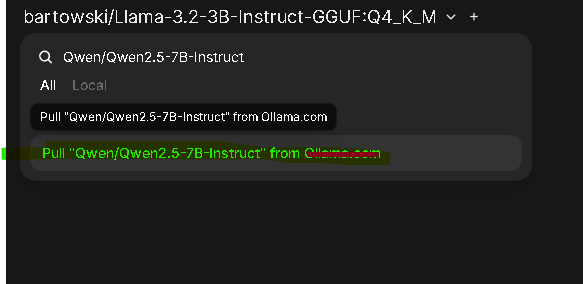
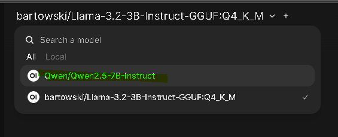
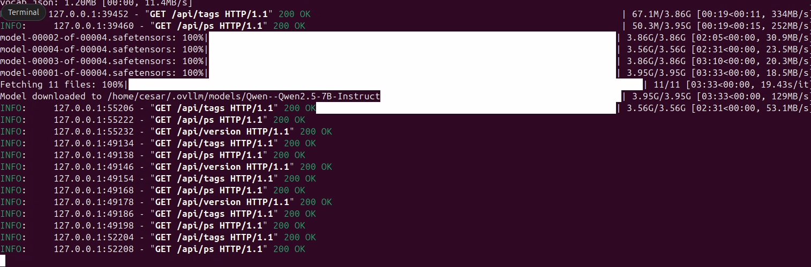
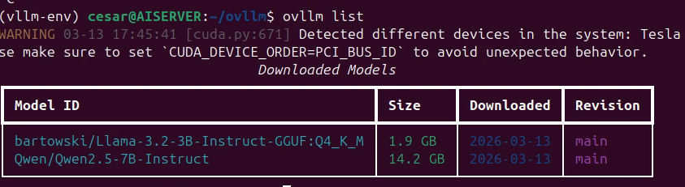
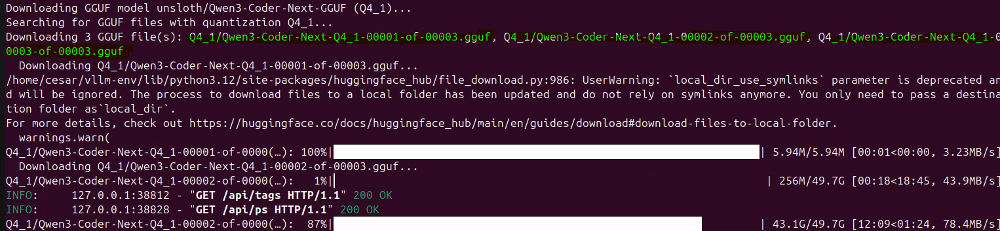

# Ovllm

**Ovllm** is a user-friendly wrapper around [vLLM](https://github.com/vllm-project/vllm) that provides Ollama-like simplicity for downloading and serving LLM models from HuggingFace. It's designed to work seamlessly with [OpenWebUI](https://github.com/open-webui/open-webui).

## Features

- 🚀 **One-command model downloads** - Pull models directly from HuggingFace Hub
- 🎯 **Ollama-like CLI** - Familiar commands: `ovllm pull`, `ovllm run`, `ovllm serve`
- 🔌 **OpenWebUI Ready** - Drop-in replacement for Ollama backend
- 📦 **Model Management** - List, remove, and manage downloaded models
- ⚡ **vLLM Performance** - Full vLLM inference engine with continuous batching
- 🛠️ **OpenAI Compatible** - Serve models via OpenAI-compatible API

### Images of it Working








## Installation

### Prerequisites

- Python 3.9+
- CUDA-capable GPU (for GPU inference)
- HuggingFace account (for some models)

### Install from source

```bash
# Clone the repository
git clone https://github.com/ovllm/ovllm.git
cd ovllm

# Install dependencies
pip install -r requirements.txt

# Install Ovllm
pip install -e .
```

### Verify installation

```bash
# Run test script
python -m ovllm --help

# Or test imports
python tests/test_install.py
```

## Quick Start

### 1. Download and run a model interactively

```bash
ovllm run meta-llama/Llama-2-7b-chat-hf
```

This will automatically download the model if not present, then start an interactive chat session.

### 2. Pull a model for later use

```bash
ovllm pull meta-llama/Llama-2-7b-chat-hf
```

### 3. Start the API server

```bash
ovllm serve
```

### 4. Connect to OpenWebUI

Set OpenWebUI's Ollama URL to `http://localhost:11434` or use Docker:

```bash
docker run -d \
  -p 3000:8080 \
  -e OLLAMA_BASE_URL=http://host.docker.internal:11434 \
  --add-host=host.docker.internal:host-gateway \
  ghcr.io/open-webui/open-webui:main
```

## CLI Commands

| Command | Description |
|---------|-------------|
| `ovllm run <model>` | Run a model interactively (auto-downloads if missing) |
| `ovllm pull <model>` | Download a model from HuggingFace |
| `ovllm serve` | Start the API server |
| `ovllm list` | List downloaded models |
| `ovllm rm <model>` | Remove a downloaded model |
| `ovllm show <model>` | Show model details |
| `ovllm ps` | Show running models |

## Model Sources

Ovllm supports any model from HuggingFace Hub:

```bash
# Meta Llama models
ovllm pull meta-llama/Llama-2-7b-chat-hf

# Mistral AI models
ovllm pull mistralai/Mistral-7B-Instruct-v0.3

# Google Gemma models
ovllm pull google/gemma-7b-it

# Qwen models
ovllm pull Qwen/Qwen2.5-7B-Instruct

# Local models
ovllm run /path/to/local/model
```

### GGUF Models (Quantized)

Ovllm supports GGUF models with specific quantization levels. Specify the quantization suffix after the model ID:

```bash
# Llama-3.2 3B with Q4_K_M quantization
ovllm pull bartowski/Llama-3.2-3B-Instruct-GGUF:Q4_K_M

# Run with specific quantization
ovllm run bartowski/Llama-3.2-3B-Instruct-GGUF:Q4_K_M

# Other popular quantizations
ovllm pull bartowski/Llama-3.2-3B-Instruct-GGUF:Q5_K_M
ovllm pull bartowski/Llama-3.2-3B-Instruct-GGUF:Q6_K
ovllm pull bartowski/Llama-3.2-3B-Instruct-GGUF:Q8_0
```

Available quantizations depend on the specific GGUF model repository. Common options include:
- `Q4_K_M` - Good balance between size and quality
- `Q5_K_M` - Better quality, larger size
- `Q6_K` - High quality
- `Q8_0` - Near lossless quality

## Configuration

Set environment variables or use CLI flags:

| Variable | Description | Default |
|----------|-------------|---------|
| `OVLLM_HOST` | Server host | `0.0.0.0` |
| `OVLLM_PORT` | Server port | `11434` |
| `OVLLM_MODELS_DIR` | Model storage directory | `~/.ovllm/models` |
| `OVLLM_GPU_MEMORY` | GPU memory utilization | `0.9` |
| `HF_TOKEN` | HuggingFace token (for gated/private models) | - |
| `OVLLM_LOG_LEVEL` | Logging level | `INFO` |

### HuggingFace Authentication

Some models (like Meta's Llama series) require authentication and license acceptance:

1. **Create a HuggingFace account** at https://huggingface.io/login

2. **Accept the model license** (for gated models like Llama):
   - Visit the model page (e.g., https://huggingface.co/meta-llama/Llama-3.2-3B-Instruct)
   - Click "Agree and access"

3. **Get your access token**:
   - Go to https://huggingface.co/settings/tokens
   - Create a new token with "read" permissions
   - Copy the token

4. **Set the token as an environment variable**:
   ```bash
   # Linux/macOS
   export HF_TOKEN=hf_xxxxx

   # Windows PowerShell
   $env:HF_TOKEN="hf_xxxxx"

   # Windows CMD
   set HF_TOKEN=hf_xxxxx
   ```

5. **Run ovllm**:
   ```bash
   ovllm pull meta-llama/Llama-3.2-3B-Instruct
   ```

## API Endpoints

Ovllm provides an OpenAI-compatible API:

| Endpoint | Description |
|----------|-------------|
| `POST /v1/chat/completions` | Chat completion |
| `POST /v1/completions` | Text completion |
| `GET /v1/models` | List available models |
| `POST /api/pull` | Pull a model |
| `GET /api/tags` | List local models |
| `DELETE /api/delete` | Delete a model |
| `POST /api/generate` | Generate completion (Ollama-compatible) |
| `POST /api/chat` | Chat completion (Ollama-compatible) |

## Example Usage

### Python Client

```python
from openai import OpenAI

client = OpenAI(
    base_url="http://localhost:11434/v1",
    api_key="not-needed"
)

response = client.chat.completions.create(
    model="meta-llama/Llama-2-7b-chat-hf",
    messages=[
        {"role": "system", "content": "You are a helpful assistant."},
        {"role": "user", "content": "Hello!"}
    ]
)

print(response.choices[0].message.content)
```

### cURL

```bash
curl http://localhost:11434/v1/chat/completions \
  -H "Content-Type: application/json" \
  -d '{
    "model": "meta-llama/Llama-2-7b-chat-hf",
    "messages": [
      {"role": "user", "content": "Hello!"}
    ]
  }'
```

## Docker Deployment

### Using Docker Compose (recommended)

```bash
# Start Ovllm + OpenWebUI
docker-compose up -d
```

### Manual Docker

```bash
# Build image
docker build -t ovllm .

# Run Ovllm
docker run -d \
  -p 11434:11434 \
  -v ovllm_models:/root/.ovllm/models \
  --gpus all \
  ovllm

# Run OpenWebUI
docker run -d \
  -p 3000:8080 \
  -e OLLAMA_BASE_URL=http://host.docker.internal:11434 \
  --add-host=host.docker.internal:host-gateway \
  ghcr.io/open-webui/open-webui:main
```

## Architecture

```
┌─────────────────────────────────────────────────────────────┐
│                    Ovllm CLI                                │
│  run / pull / serve / list / rm / show                     │
└─────────────────────────────────────────────────────────────┘
                              │
                              ▼
┌─────────────────────────────────────────────────────────────┐
│                  Model Manager                               │
│  - Downloads from HuggingFace                               │
│  - Manages local cache (~/.ovllm/models)                   │
│  - Handles authentication                                   │
└─────────────────────────────────────────────────────────────┘
                              │
                              ▼
┌─────────────────────────────────────────────────────────────┐
│                    vLLM Engine                               │
│  - AsyncLLMEngine                                           │
│  - Continuous batching                                      │
│  - PagedAttention                                           │
└─────────────────────────────────────────────────────────────┘
                              │
                              ▼
┌─────────────────────────────────────────────────────────────┐
│              OpenAI-Compatible API                          │
│  - /v1/chat/completions                                     │
│  - /v1/completions                                          │
│  - /v1/models                                               │
└─────────────────────────────────────────────────────────────┘
```

## Troubleshooting

### Model not found

Ensure you have the correct model ID from HuggingFace Hub:
```bash
ovllm pull meta-llama/Llama-2-7b-chat-hf
```

### Out of memory

Reduce GPU memory usage:
```bash
export OVLLM_GPU_MEMORY=0.7
ovllm serve
```

### Authentication required

For private models, set your HuggingFace token:
```bash
export HF_TOKEN=hf_xxx
ovllm pull private-model
```

## License

Apache 2.0

## Acknowledgments

- [vLLM](https://github.com/vllm-project/vllm) for the inference engine
- [Ollama](https://github.com/ollama/ollama) for the UX inspiration
- [HuggingFace](https://github.com/huggingface) for the model hub
